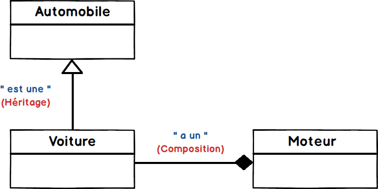

## Exercice Héritage / Composition

Différence entre l'héritage et la composition.



L'héritage et la composition permettent tous les deux de réutiliser du code.

La différence est que la composition permet de réutiliser du code sans hériter de la classe mère, contrairement à l'héritage qui doit hériter de la classe mère.

### Exemple de code

```csharp
class Moteur {} //La classe Moteur.

class Automobile {} //La classe Automobile qui est la classe mère de la classe Voiture.

class Voiture extends Automobile {   //La voiture est une automobile, donc la classe Voiture hérite la classe Automobile.

   private Moteur moteur; //Voiture a un moteur donc, la classe Voiture a une instance de la classe Moteur en tant que membre.

}
```

Source : https://waytolearnx.com/2018/08/difference-entre-heritage-et-composition.html