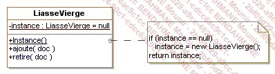

# Design patterns

## Définition

Schéma d’objet qui permet de trouver une solution à un problème courant. Optimise la conception d'objet dans une application.

## Pré requis

- Créer un repo Git bien documenter avec les prises de note de la semaine et les exercices.

- C# / Dotnet 6.

- Faire le code en anglais.

- Commenter en anglais le code si possible sinon en français.

- Base solide en POO.

## Objectifs

- Applis console pour les exercices.

- Pattern de conception.

- Pattern de structuration.

- Pattern de comportement.

## Designs patterns de conception

### Abstract factory

Permet de déresponsabiliser le classe mère. Elle permet de pouvoir modifier un comportement sans modifier la classe mère.

La classe mère détient la signature des méthodes.


Description partie de la classe scooter

La classes FabriqueVéhiculeElectrique et FabriqueVéhiculeEssence implémente une méthode qui permet de créer un scooter en fonction de son type ScooterElectrique ou ScooterEssence.


Conseil : Déclarer la fabrique en haut du code et l'instancier en fonction du choix FabriqueVehiculeEssence ou FabriqueVehiculeElectrique.

### Builder

Le builder appartient au groupe des patrons de création. Il améliore la sécurité lors de la programmation ainsi que la lisibilité du code. L’objectif du patron de conception monteur est de créer un objet au moyen d’une classe utilitaire, et non avec les constructeurs connus.


Utilisation : Un client à besoin de construire des objets copmlexes sans connaitre l'implementation.

### Factory méthode

Introduire une méthode abstraite (builder) pour préparer la construction de l'objet.


### Singleton

Le pattern est un patron de conception de création qui garantit que l’instance d’une classe n’existe qu’en un seul exemplaire, tout en fournissant un point d’accès global à cette instance.

Le pattern singleton est utilisé pour créer une instance unique d'une classe.

Le pattern Abstract est suceptible d'utiliser ce type d'instance unique.

Notre application va utiliser la classe liasse vierge
(LiasseVierge) qui ne possédera qu'une seule instance.




Chaque classe qui utilise la liasse vierge doit avoir accès
à la même instance. On doit surtout s'arranger pour qu'on ne puisse pas en créer de nouvelles
(avec l'opérateur new).

### Prototype

Le pattern permet la création d'objets à partir d'autres objets appelés "prototypes"
disposant d'une méthode Clone() qui retourne un objet identique.


Exercice :

- Code + schéma du pattern prototype
- Schéma du pattern singleton
- => code du pattern singleton

Code Singleton Vendeur :

```csharp
    namespace Prototype;

    public class Vendeur
    {
        private static Vendeur _instance = null;

        public String nom { get; set; }
        public String prenom { get; set; }

        private Vendeur()
        {
        }

        public static Vendeur getInstance()
        {
            if (_instance == null)
            {
                _instance = new Vendeur();
            }
            return _instance;
            
        }
    }

```

Code test du singleton
```csharp
static void Main(string[] args)
{
    Vendeur vendeur1 = Vendeur.getInstance();
    vendeur1.nom = "ROSSAT";
    vendeur1.prenom = "Nicolas";
    
    Console.WriteLine("Nom : " + vendeur1.nom);
    Console.WriteLine("Prenom : " + vendeur1.prenom);
    
    Vendeur vendeur2 = Vendeur.getInstance();
    vendeur2.nom = "RORO";
    vendeur2.prenom = "Nico";
    
    Console.WriteLine("Vendeur 1 : ");
    Console.WriteLine("Nom : " + vendeur1.nom);
    Console.WriteLine("Prenom : " + vendeur1.prenom);
    
    Console.WriteLine("Vendeur 2 : ");
    Console.WriteLine("Nom : " + vendeur2.nom);
    Console.WriteLine("Prenom : " + vendeur2.prenom);
}
```